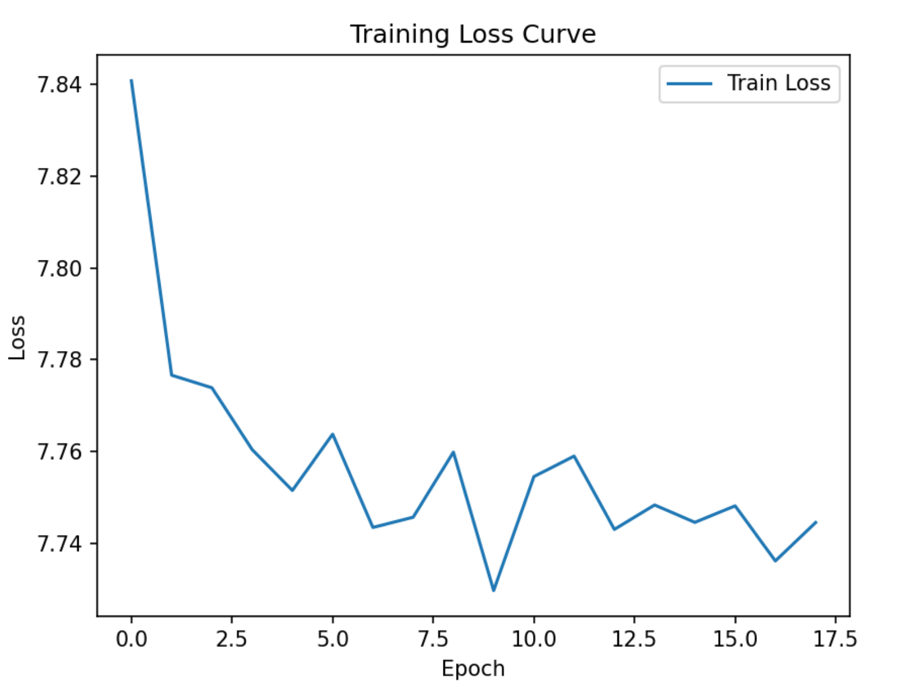

# Gemini

## Introduction

This is the **unoffical** code for the paper "Gemini: Neural Network-based Graph Embedding for Cross-Platform Binary Code Similarity Detection", CCS 2017, Pytorch version.


## Data Format

```bash
├─── binary_name
└─── raw_graph_list         # list
    ├─── g                  # <DiGraph>
    │   ├─── nodes
    │   ├─── edges
    │   └─── adj 
    ├─── discovre_features
    └─── funcname           
```

e.g.:

```bash
# a raw_graph
{'old_g': <networkx.classes.digraph.DiGraph object at 0x7ff18b657040>, 'discovre_features': [2, 3, 3, 0, 3, 3, 4, 36, 0.0, ['h', 'h'], [4294967295, 4294967295, 3066169, 1, 16]], 'g': <networkx.classes.digraph.DiGraph object at 0x7ff18af3a0e0>, 'funcname': 'check_end'}
# a DiGraph object
DiGraph with 3 nodes and 3 edges
[0, 1, 2]
[(0, 2), (1, 0), (1, 2)]
{0: {2: {}}, 1: {0: {}, 2: {}}, 2: {}}
```

## Performance



```
Accuracy: 0.774917, AUC: 0.876182
```

The dataset is very small (only `openssl-101f`), so the performance is not good as the paper.

## Similarity Inference

A simple inference script is provided in `inference.py`. 

For example, to get the similarity between `EVP_DigestInit_ex` in all `openssl-101a_arm_gcc_O3_openssl` functions, run

```bash
python inference.py 
```

And the TOP5 result is: (including the query function itself)

```bash
# FunctionName      CosineSimilarity
EVP_DigestInit_ex   0.99999994
EVP_DigestInit      0.98464435
d2i_ECPrivateKey    0.97722644
i2d_ECPrivateKey    0.9714543
v2i_AUTHORITY_KEYID 0.9705293
``` 


## CopyRight

You can only use this code after obtaining the author's permission.

## Acknowledgment

https://github.com/Yunlongs/Gemini

LyuLumos©2023 All Rights Reserved.


